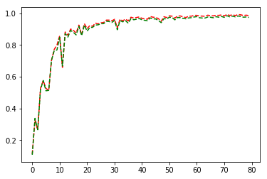

#**Traffic Sign Recognition**

**Build a Traffic Sign Recognition Project**

The goals / steps of this project are the following:
* Load the image data set
* Explore, summarize and visualize the data set
* Design, train and test a model architecture
* Use the model to make predictions on new images
* Analyze the softmax probabilities of the new images
* Summarize the results with a written report

**1.Data Set Summary & Exploration**

Data consists of 32x32 size images of Traffic signs with labels. Each image is represented in RGB form.
There are 43 different types of Traffic signs included in the data set.
Data provided is split into 3 parts.
1. Number of training examples = 178493
2. Number of validation examples = 12630
3. Number of testing examples = 12630
4. Image data shape = (32, 32, 3)
5. Number of classes = 43
The code for this step is contained in the third code cell of the IPython notebook.

**2.Visualization of the dataset and identify where the code is in your code file**

The bar chart below is histogram of number of training examples for each class in the training set.

The code for this step is contained in the third code cell of the IPython notebook.

**Design and Test a Model Architecture**

***1. Describe how, and identify where in your code, you preprocessed the image data. What techniques were chosen and why did you choose these techniques? Consider including images showing the output of each preprocessing technique. Pre-processing refers to techniques such as converting to grayscale, normalization, etc.***

Image is converted from RGB space to YUV space. Several vision research papers typically use this as part of the image pipeline. It encodes a color image taking human perception into account and allows bandwidth for chrominance components. This results in masking of transmission errors.

'Y' channel represents  luminosity/brightness in the image. I normalize this channel using CLHAE histogram normalization to take away effect of brightness variations.

As next step, image values are normalized and converted from 0-255 range to 0-1 range. This normalization of values helps during training optimization by converging to minima faster.

Example of traffic sign before and after processing.

The code for this step is contained in the fifth code cell of the IPython notebook.

***2. Describe how, and identify where in your code, you set up training, validation and testing data. How much data was in each set? Explain what techniques were used to split the data into these sets. (OPTIONAL: As described in the "Stand Out Suggestions" part of the rubric, if you generated additional data for training, describe why you decided to generate additional data, how you generated the data, identify where in your code, and provide example images of the additional data)***

As we can see from sample distribution across classes, some classes have very few training samples. Also there is wide variation in samples for several classes.

I augment training and validation set by applying following process.

1. For each image in the training set, we generate 10 images.
2. Each generated image is distorted randomly based on factors like rotation, translation and shear. Affine transformations like these maintains collinearity of points and ratios of distances. This process adds variations in trainng and makes the model more robust.
3. From this augmented image set, 25% of randomly selected images are added to the validation set and rest are added to training set. After this step validation set has 91408 images.
4. In training set, a hard cutoff of 6000 samples per image is kept. We want to ensure that ratio of samples in popular classes to rare classes in maintained and at the same time not bias the classifier too much towards popular classes. This cut-off was reached by estimation and can be improved with experimentation
5. New distribution of training set samples per class is shown below

Here is an example of an original image and an augmented image:

Original Image

Example of transformed images:

The code for splitting the data into training and validation sets is contained in the sixth and seventh code cell of the IPython notebook.  

***3. Describe, and identify where in your code, what your final model architecture looks like including model type, layers, layer sizes, connectivity, etc.) Consider including a diagram and/or table describing the final model.***

I tested my model with two broad types of architectures.

1. Inception Model
2. Lenet Model

I was achieving almost similar accuracy numbers with both the models. Though it took really long time to train inception model. As a result my final report is generated on Lenet model. LeNet Model Architecture is shown below

The code for my final model is located in the twelfth cell of the ipython notebook.

***4. Describe how, and identify where in your code, you trained your model. The discussion can include the type of optimizer, the batch size, number of epochs and any hyperparameters such as learning rate.***

Adams optimizer is used with learning rate of 0.001 and epsilon of 0.1. I also experimented with learning rate of 0.005.
Batch size - 128 with 80 Epoch to train. Smaller batch size helped in converging faster and 80 epochs were derived after observing the training and validation accuracy graph.

The code for training the model is located in the fourteenth and fifteenth  cell of the ipython notebook.

***5. Describe the approach taken for finding a solution. Include in the discussion the results on the training, validation and test sets and where in the code these were calculated. Your approach may have been an iterative process, in which case, outline the steps you took to get to the final solution and why you chose those steps. Perhaps your solution involved an already well known implementation or architecture. In this case, discuss why you think the architecture is suitable for the current problem.***

I took an iterative approach towards a final solution. While the current literature shows VGG Net and Inception architecture provide good results, I was keen to experiment and move towards those solutions. I started with basic LeNet architecture and got roughly 94% accuracy. After that I modified LeNet by adding 1X1 layers to increase depth which resulted in increase in accuracy. Dropout operation was added to each of the fully connected layers to reduce overfitting.

In addition I also experimented with Inception architecture. In my experiments it took long time to train and gave similar results. I

After 80 Epochs,

Train accuracy - 98.2%

Validation accuracy - 97.4%

Test accuracy - 96.4%

The code for calculating the accuracy of the model is located in the sixteenth and seventeenth cell of the Ipython notebook.

**Test a Model on New Images**

***1. Choose five German traffic signs found on the web and provide them in the report. For each image, discuss what quality or qualities might be difficult to classify.***

Here are six German traffic signs that I found on the web:

I resized these images and pre-processed them before passing them through the classifier. On this set classifier got an accuracy of 66.67% and was unable to classify two images correctly.
Image 5 is taken at a distance and the sign is at an angle more then 20 degrees.
Image 4 is also not classified correctly. It is being mis-identified as a speed limit 20 sign instead of speed limit 60.

***2. Discuss the model's predictions on these new traffic signs and compare the results to predicting on the test set. Identify where in your code predictions were made. At a minimum, discuss what the predictions were, the accuracy on these new predictions, and compare the accuracy to the accuracy on the test set (OPTIONAL: Discuss the results in more detail as described in the "Stand Out Suggestions" part of the rubric).***

The code for making predictions on my final model is located in the tenth cell of the Ipython notebook.

Here are the results of the prediction:

Model was correctly able to predict for 4/6 images. As explained earlier both the images had significant differences compared to images used in training and testing. The other four images were similar in nature to the testing images.

***3. Describe how certain the model is when predicting on each of the five new images by looking at the softmax probabilities for each prediction and identify where in your code softmax probabilities were outputted. Provide the top 5 softmax probabilities for each image along with the sign type of each probability. (OPTIONAL: as described in the "Stand Out Suggestions" part of the rubric, visualizations can also be provided such as bar charts)***

As we can see from the above visualization, model is very sure of the predictions in case of Images 1,2,3 and 6.
In case of image 4 ("Speed Limit 60" sign ) model is confused between classes 1,3 and 2 . All of those classes are speed limit signs. Model is not able to correctly recognize "Speed limit 60" sign and classifies it as "Speed limit 30"
In Image 5 model is not able to correctly recognize the sign and is mis classifying it as "Speed limit 30" sign.

The code for making predictions on my final model is located in the 19th and 21st cell of the Ipython notebook.
